# Virtualization
We'll virtualize all our VM's and Docker containers via Proxmox. I'll install the VE version via a bootable USB stick and will configure Proxmox so that it runs properly for now.

Then , I'll install our first VM and get into containerization via Docker as I'd like to install my Jellyfin media server this way.

## Creating a bootable USB stick
Via the Proxmox website, download the ISO (the version installed here will be the 8.2 one) :

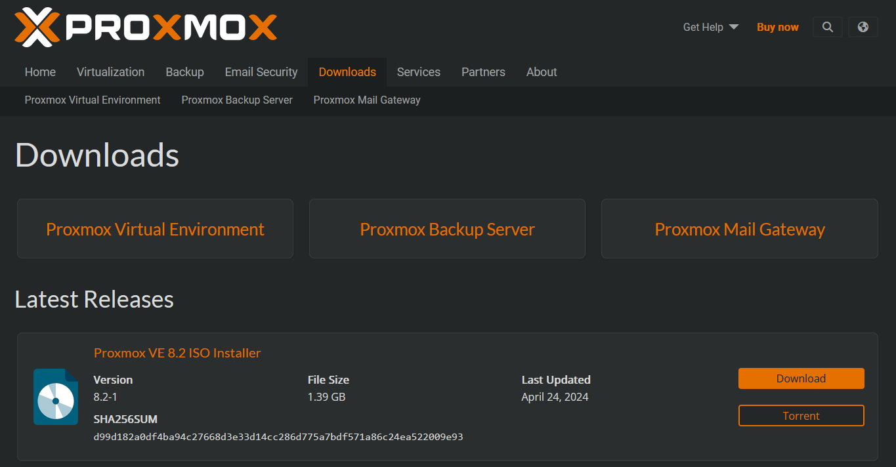

After getting the iso, and by following the Proxmox documentation, we download [balenaEtcher](https://etcher.balena.io/#download-etcher) to create the bootable USB :

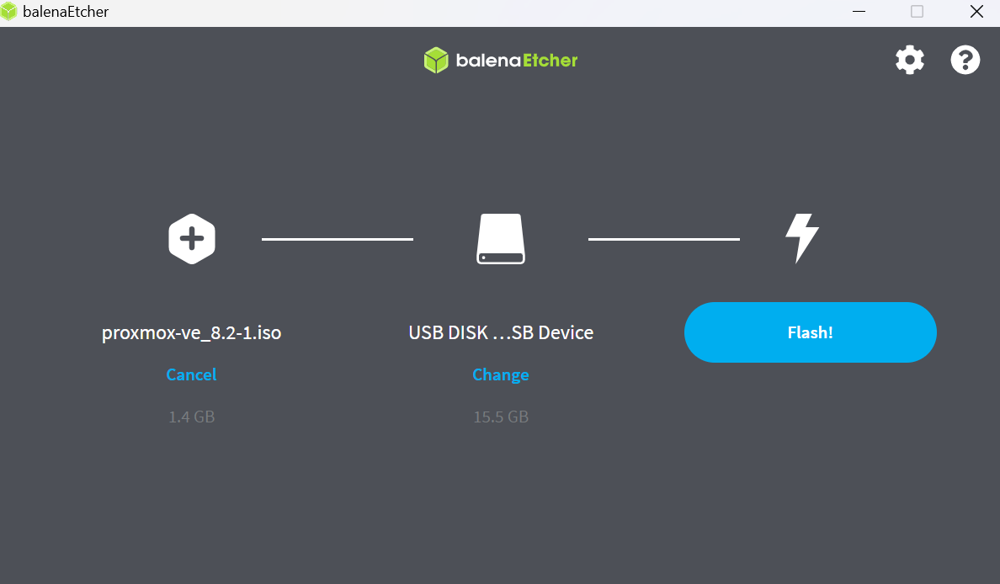

## Launching the server via the bootable USB stick

This is easily done in Windows via the "Restoration" parameters, or you can also enter the BIOS to adapt the booting order of your machine.

When adapted, the Proxmox installation setup launches and guides you quite usefully through the process :

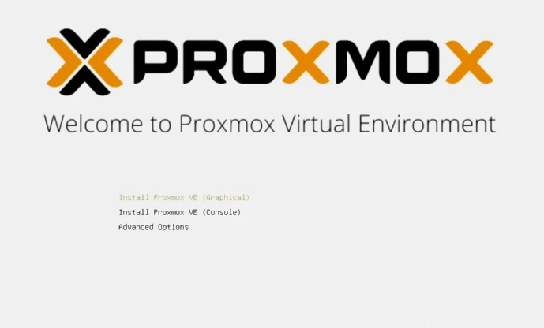

I'm not going to got into the details, but just know that I'll use my entire SSD for the installation.

And after some tweaking linked to Proxmox wanting to use the ethernet cable by default while I was insisting on wi-fi, it works now via the website interface on my main PC !

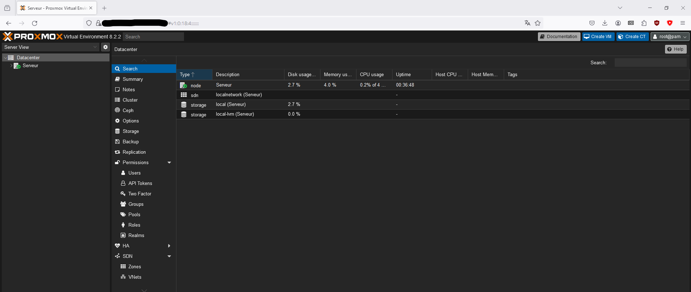

## Doing the server's first setup
### 3.1 Update
Before doing anything, we'll update the server for the first time. Since this is a free version of Proxmox, we need to adapt the repositories to reflect this choice.
Let's clink on our node, and then go into the repository folder under "Updates":

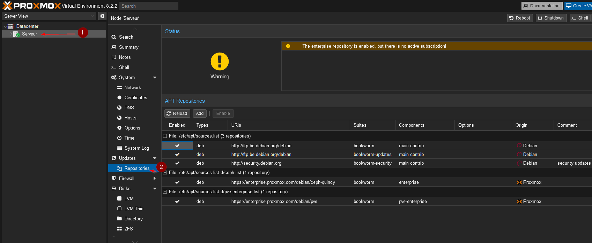

There, we'll click on the "Add" button, click "OK" in the appaearing message and adapt our repository to "No Subscription"

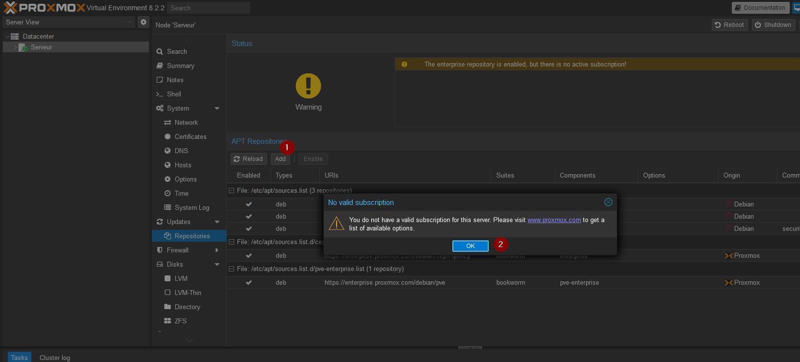
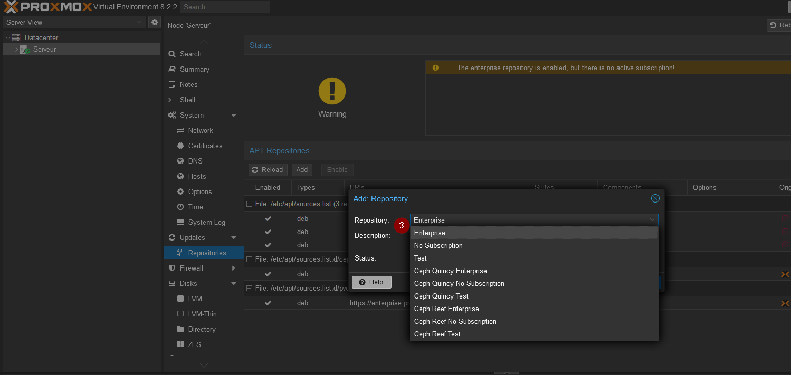

When done, let's go up to the "Updates" folder to refresh and upgrade our system :

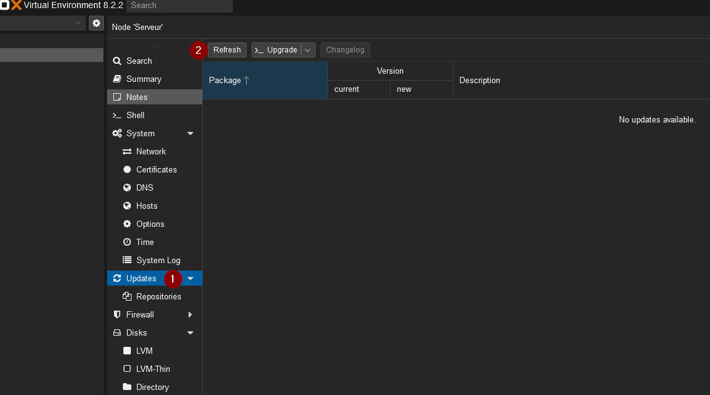
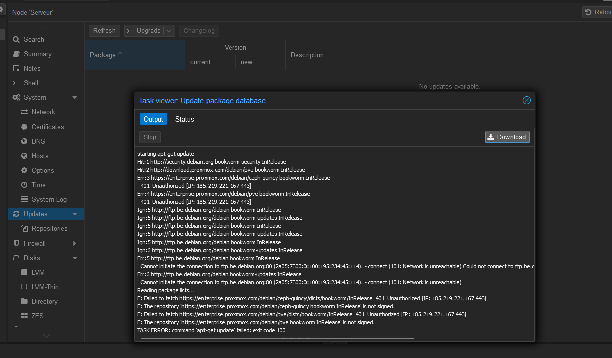

Seems I'm getting some error, but I believe this comes from the fact that the repo Proxmox is trying to reach are the one with subscription. Let's upgrade to see if any error pops up too :

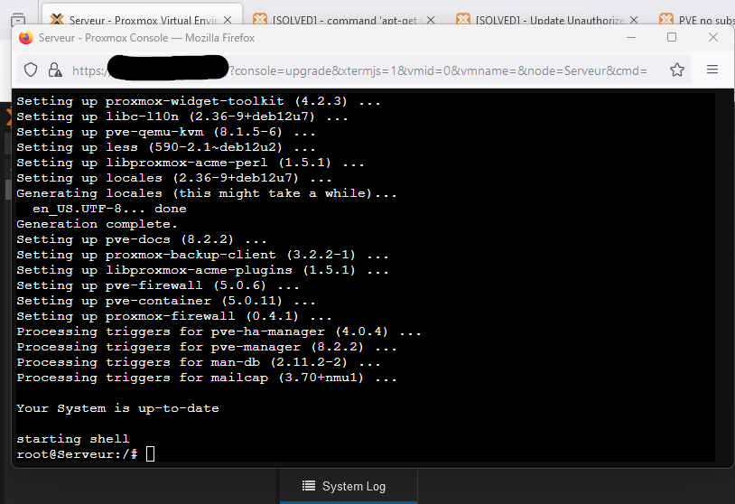

It seems to be fine for now, let's go back to the repositories to fix our issue by disabling both "Enterprise" repo. It shouldn't be too much of a problem as Proxmox's documentation itself tells that the main difference is that the "No-subscription" repo is [good for testing and non-production uses](https://pve.proxmox.com/wiki/Package_Repositories#sysadmin_no_subscription_repo), which is exactly what we're doing right now.

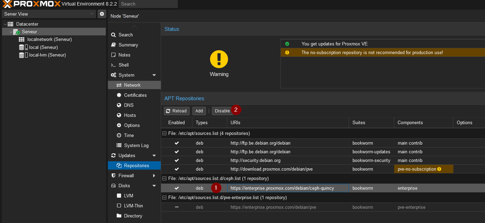

### 3.2 Creating our first VM

For our first VM, we'll install a simple Ubuntu image from the official website. To put it in Proxmox, we'll click on our server, then go to its "local" section (this is the part where ISO and container images can be stored) and from there, we can go to "Download URL"

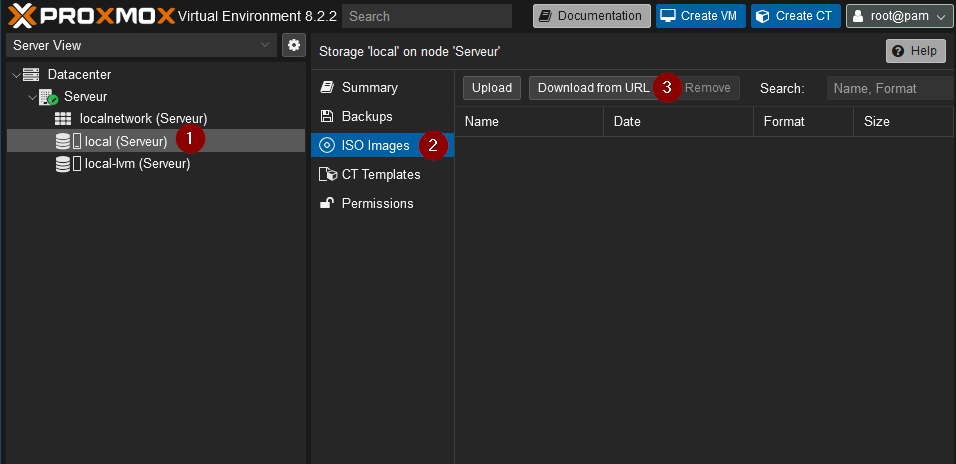

This'll open a small window where we can paste our download URL and where we'll adapt the name of our VM.
Here, I typed "Ubuntu 24.04 LTS" to reflect the full version of the OS.
Finally, just click on "Download" to trigger the install. (<b>Don't forget to mention the .iso extension in your file name, to the contrary of what's shown below. Otherwise it'll trigger an error message</b>)

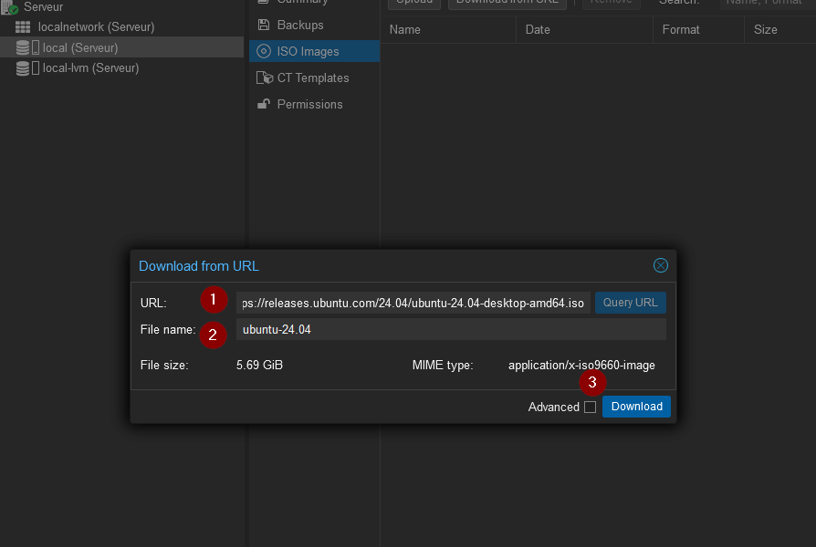

When finished, you'll see that your ISO image is now available for being installed in the list. From there, we'll click on the "Create VM" button in the top right corner to properly install it.

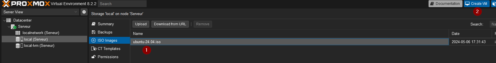

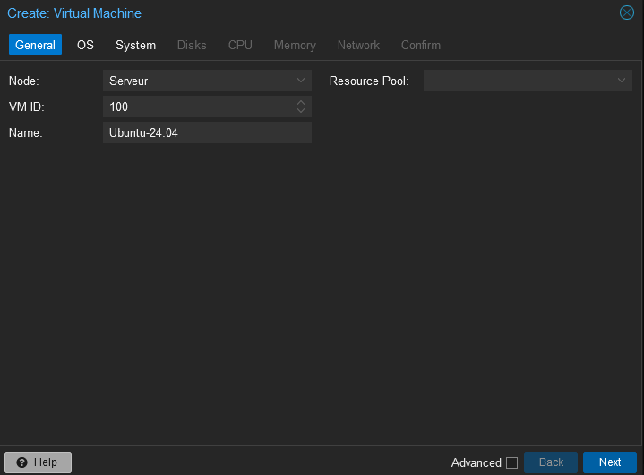

We will allow to this machine the below specs. They are similar to the ones advised on the official Ubuntu website.
- 2 GHz dual-core processor or better
- 4 GB system memory
- 25 GB of free hard drive space

I won't go through the whole set-up here as everything is well detailed. But I'll simply mention the following :

- In the "System" tab, ensure to check the "Qemu Agent" box as this will help virtualize your server's hardware to pass it to the VM, thus ensuring your SSD's can be read by the machine.

- In the "Disks" tab, please toggle on the option "Discard" if you're using an SSD as storage as it'll ensure that deleted data are indeed freed from the SSD's space instead of being wrongly reported as present still. More info on this [here](https://pve.proxmox.com/pve-docs/pve-admin-guide.html#qm_virtual_machines_settings).

Here's the final summary of our VM's installation :

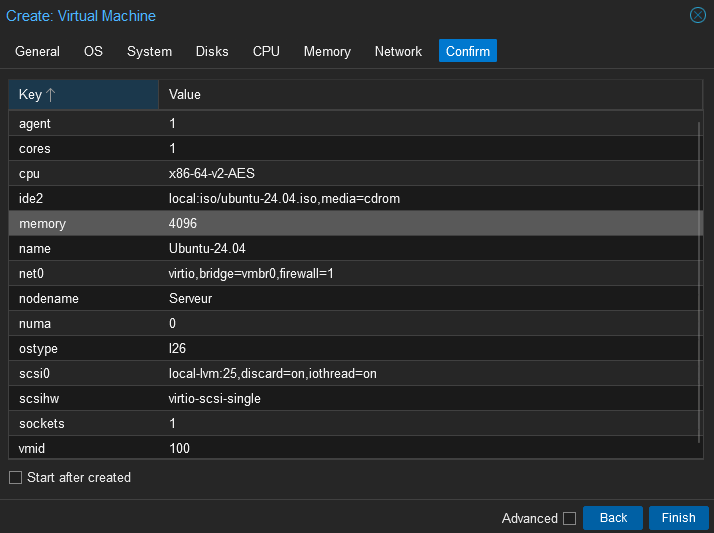

### 3.3 Installing our first VM

There's nothing really magical to talk about here as it's all very dependent on what your hardware and needs are. I just did set up everything and it went smoothly after having rebooted 

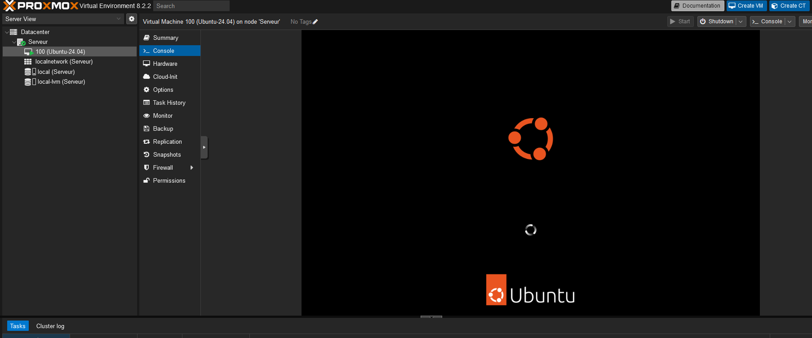

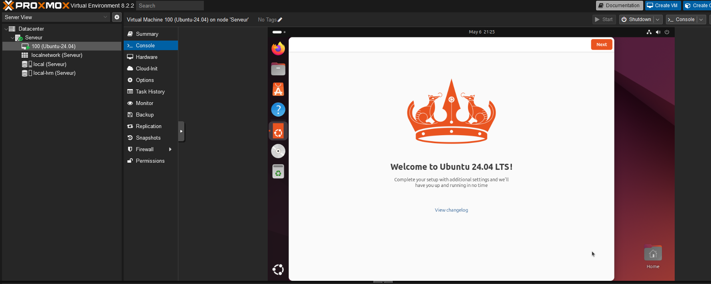

## Final notes

This VM was set up just for us to test the VM creation in Proxmox, although it may help us install our Wazup SIEM/XDR solution on our server. It's quite impressive to see how easy it is to install. I will check further on if any additionnal security features inside the VM are needed.
