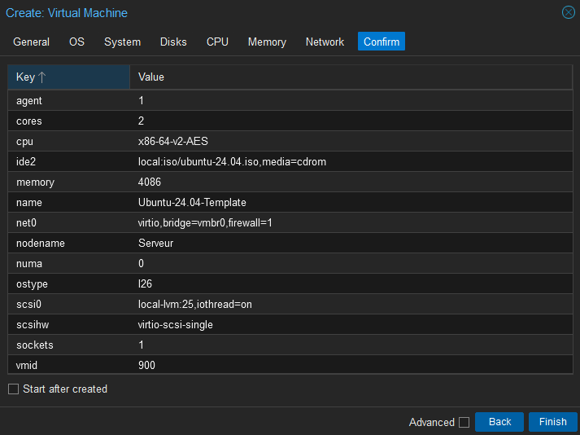
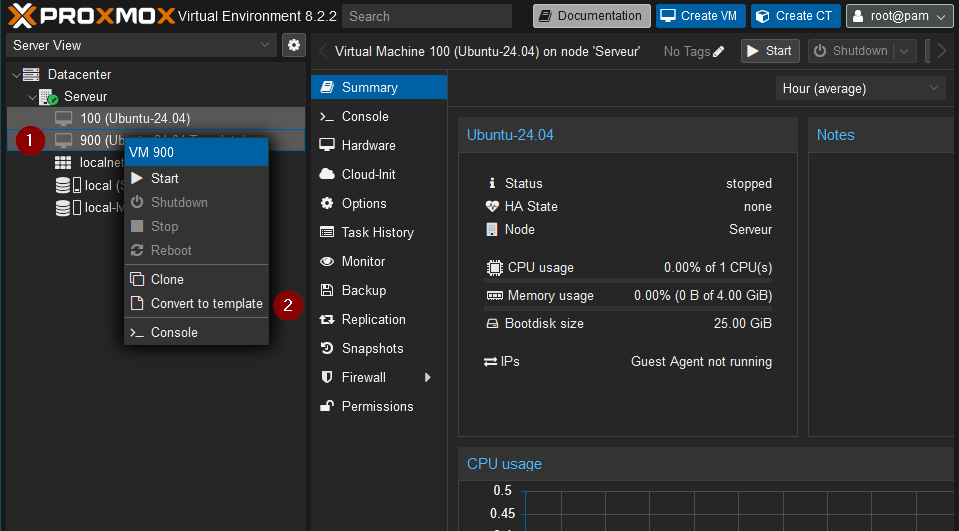
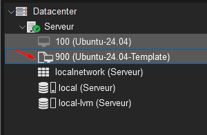

# Templates and clones in Proxmox
## What is it ?
Templates are blueprints of VM's that we set up once to then be able to set-up fast new VM's without having to assign all of its characteristics every time.

Clones are created from templates and can come in two flavours :

    - Full clones : they're totally independant from the original template as they run alone and with their own disk space.
    - Linked clones : they are dependent on the original template for running and for their disk space.

## Why use it ?
In our environment, we'll use templates to run our OpenVPN solution and for our media server.
In bigger environments, templates and clones are mainly used to set up quickly lots of machines without having to lose enormous amount of times on setting them up individually.

## Walkthrough
### Creation of the template
We'll used Ubuntu 22.04 for our first template. Its creation is very similar to the one of a VM (see the [Virtualization]() section for a more thorough explanation) so we'll just talk about the changes here :
    
    - I'll use the 9XX ID nomenclature for my templates (so this first template will get ID 900)
    - I'll give 2 cores for this template since OpenVPN and my media server would benefit of it. Increases will certainly be done for the media server, but this can be tweaked afterwards without issues.

Here's the summary of the setup :

When finished, right click on your template and click on "Convert to template"

Let your system work it out, and when the icon has turned to white, your template is ready to be cloned !

## Cloud images for big infrastructure

I've read about cloud images being a good way for setting up these kind of templates as it allows for very light images to be spread accross an infrastructure in an even more efficiant way. It's especially convenient since it allows you to use the [cloud-init](https://pve.proxmox.com/wiki/Cloud-Init_Support) file which permits you to configure your images to fit exactly your needs. In my case, since this is purely an educational/personal project, I'll keep it as is for now and will build upon it in the future.
